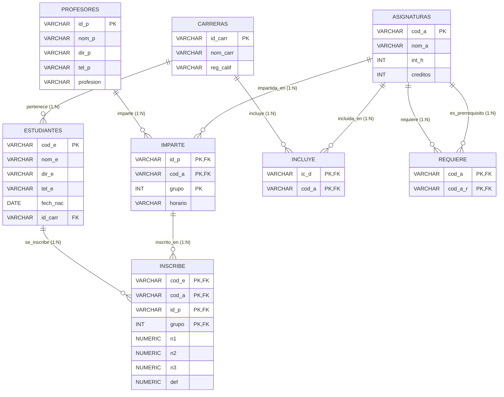

# Diagrama Entidad-Relación (ER) - Mermaid
## Sistema de Gestión Académica

### Descripción
Diagrama ER que modela las entidades principales del sistema académico, sus atributos y las relaciones entre ellas, incluyendo las entidades débiles (tablas de relación).

### Relaciones entre Entidades

| Relación | Entidad 1 | Entidad 2 | Cardinalidad | Descripción |
|----------|-----------|-----------|--------------|-------------|
| Pertenece | Estudiantes | Carreras | N:1 | Un estudiante pertenece a una carrera |
| Imparte | Profesores | Asignaturas | N:M | Un profesor puede impartir varias asignaturas en diferentes grupos |
| Inscribe | Estudiantes | Imparte | N:M | Un estudiante se puede inscribir a varias asignaturas |
| Incluye | Carreras | Asignaturas | N:M | Una carrera incluye varias asignaturas en su pensum |
| Requiere | Asignaturas | Asignaturas | N:M | Una asignatura puede requerir prerrequisitos |

### Reglas de Negocio

1. **Integridad referencial**: No se puede eliminar una carrera si hay estudiantes asociados.
2. **Prerrequisitos**: Un estudiante no puede inscribirse en una asignatura si no ha aprobado sus prerrequisitos (definitiva >= 3.0).
3. **Cálculo automático**: La nota definitiva se calcula automáticamente mediante trigger: `def = (n1 * 0.35) + (n2 * 0.35) + (n3 * 0.30)`.
4. **Notas válidas**: Las notas n1, n2, n3 deben estar entre 0.0 y 5.0.
5. **Grupo único**: La combinación (id_p, cod_a, grupo) debe ser única en la tabla Imparte.

---

**Versión**: 1.0 (Mermaid)
**Fecha**: 9 de mayo de 2026
**Autor**: Proyecto Académico
