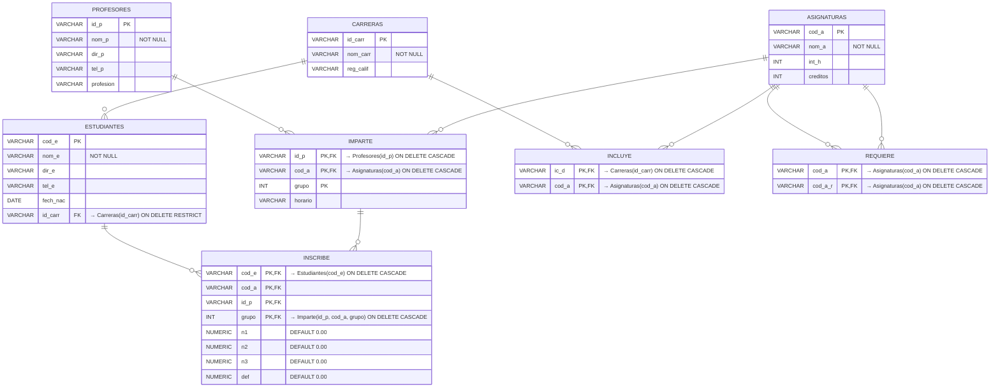

# Diagrama Relacional - Mermaid
## Sistema de Gestión Académica

### Descripción
Representación del esquema relacional de la base de datos PostgreSQL. Muestra las tablas, columnas, claves primarias (PK), claves foráneas (FK) y las relaciones de integridad referencial entre tablas.



### Integridad Referencial

| Tabla Hija | Columna(s) FK | Tabla Padre | Acción ON DELETE |
|------------|---------------|-------------|------------------|
| Estudiantes | id_carr | Carreras | RESTRICT |
| Imparte | id_p | Profesores | CASCADE |
| Imparte | cod_a | Asignaturas | CASCADE |
| Inscribe | cod_e | Estudiantes | CASCADE |
| Inscribe | (id_p, cod_a, grupo) | Imparte | CASCADE |
| Incluye | ic_d | Carreras | CASCADE |
| Incluye | cod_a | Asignaturas | CASCADE |
| Requiere | cod_a | Asignaturas | CASCADE |
| Requiere | cod_a_r | Asignaturas | CASCADE |

### Triggers y Funciones

**Trigger para cálculo automático de nota definitiva:**

```sql
CREATE OR REPLACE FUNCTION fn_calcular_definitiva()
RETURNS TRIGGER AS $$
BEGIN
    NEW.def := (NEW.n1 * 0.35) + (NEW.n2 * 0.35) + (NEW.n3 * 0.30);
    RETURN NEW;
END;
$$ LANGUAGE plpgsql;

CREATE TRIGGER trg_calculo_notas
BEFORE INSERT OR UPDATE OF n1, n2, n3 ON Inscribe
FOR EACH ROW
EXECUTE FUNCTION fn_calcular_definitiva();
```

### Índices Recomendados

```sql
-- Índice para buscar estudiantes por carrera
CREATE INDEX idx_estudiante_carrera ON Estudiantes(id_carr);

-- Índice para buscar inscripciones por estudiante
CREATE INDEX idx_inscribe_estudiante ON Inscribe(cod_e);

-- Índice para buscar asignaturas por prerrequisito
CREATE INDEX idx_requiere_prerrequisito ON Requiere(cod_a_r);

-- Índice para buscar carga académica por profesor
CREATE INDEX idx_imparte_profesor ON Imparte(id_p);
```

---

**Versión**: 1.0 (Mermaid)
**Fecha**: 9 de mayo de 2026
**Autor**: Proyecto Académico
