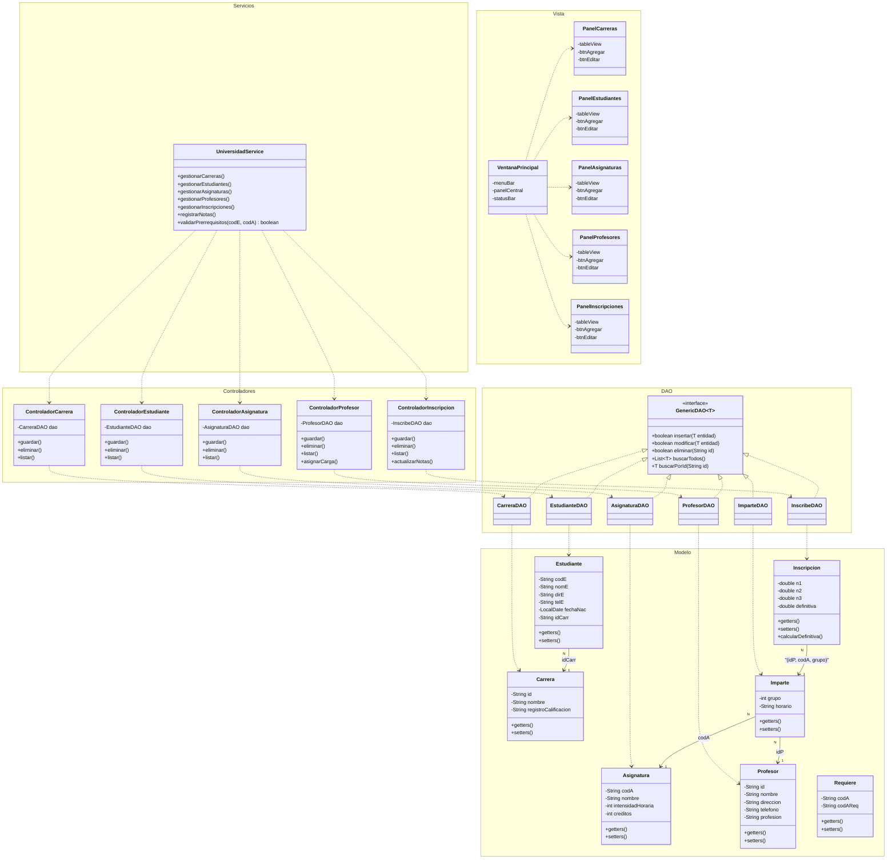

# Diagrama de Clases UML - Mermaid
## Sistema de Gestión Académica

### Descripción
Diagrama de clases que representa la arquitectura en capas del sistema: Modelo (dominio), DAO (acceso a datos), Servicios, Controladores y Vista (JavaFX).



### Conexión a Base de Datos (Singleton)

```java
public class ConexionDB {
    private static Connection instancia = null;
    private static final String URL = "jdbc:postgresql://localhost:5432/db_sistema_academico";
    private static final String USER = "app_admin";
    private static final String PASSWORD = "Admin_Secret2026*";

    private ConexionDB() {}

    public static Connection getConexion() {
        if (instancia == null) {
            // Cargar driver y establecer conexión
        }
        return instancia;
    }
}
```

---

**Versión**: 1.0 (Mermaid)
**Fecha**: 9 de mayo de 2026
**Autor**: Proyecto Académico
