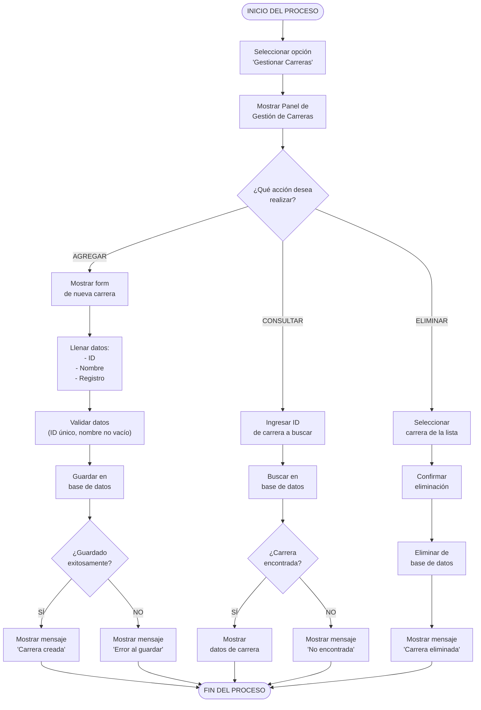

# Diagrama de Actividades - Gestionar Carreras (Mermaid)
## CU-01: Gestionar Carreras

---

## Descripción del Flujo

El usuario accede al panel de gestión de carreras y puede realizar tres acciones principales: **agregar**, **consultar** o **eliminar** una carrera. Cada acción tiene su propio subflujo con validaciones y manejo de errores, convergiendo todas en el fin del proceso.

---

## Diagrama Mermaid

---

## Notas

- **Validación**: Se verifica que el ID sea único y el nombre no esté vacío antes de guardar.
- **Consulta**: Si la carrera no existe, se muestra un mensaje informativo.
- **Eliminación**: Se requiere confirmación explícita antes de ejecutar el DELETE.
- Las tres ramas convergen al final del proceso.

---

**Versión**: 1.0 (Mermaid)
**Fecha**: 10 de mayo de 2026
