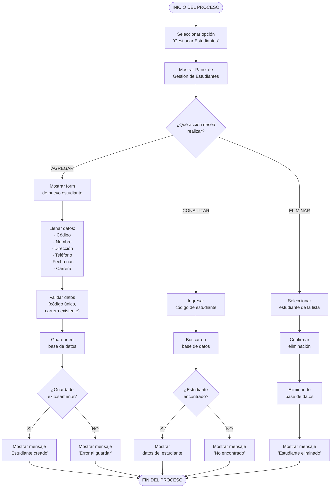

# Diagrama de Actividades - Gestionar Estudiantes (Mermaid)
## CU-02: Gestionar Estudiantes

---

## Descripción del Flujo

El usuario accede al panel de gestión de estudiantes y puede realizar tres acciones principales: **agregar**, **consultar** o **eliminar** un estudiante. Cada acción tiene su propio subflujo con validaciones específicas, incluyendo verificación de carrera existente y manejo de errores.

---

## Diagrama Mermaid

---

## Notas

- **Validación**: Se verifica código único, carrera existente y campos obligatorios.
- **Fecha de nacimiento**: Debe ser una fecha válida y no futura.
- **Eliminación en cascada**: Al eliminar un estudiante, se eliminan también sus inscripciones.
- Las tres ramas convergen al final del proceso.

---

**Versión**: 1.0 (Mermaid)
**Fecha**: 10 de mayo de 2026
