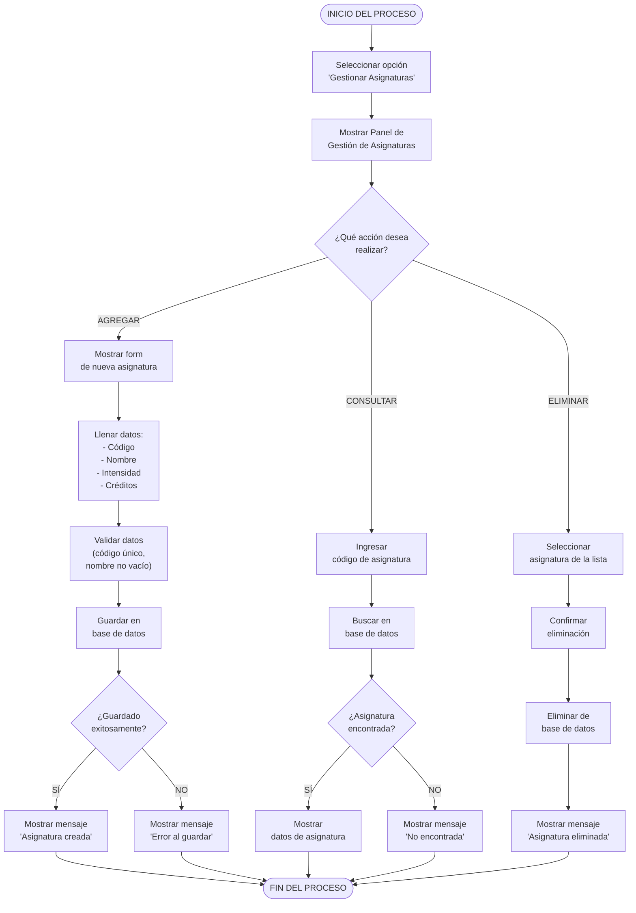

# Diagrama de Actividades - Gestionar Asignaturas (Mermaid)
## CU-03: Gestionar Asignaturas

---

## Descripción del Flujo

El usuario accede al panel de gestión de asignaturas y puede realizar tres acciones principales: **agregar**, **consultar** o **eliminar** una asignatura. Cada acción tiene su propio subflujo con validaciones específicas de rangos numéricos y manejo de errores.

---

## Diagrama Mermaid

---

## Notas

- **Validación numérica**: Intensidad horaria debe ser entre 0-20; créditos entre 1-10.
- **Integridad referencial**: No se puede eliminar una asignatura si tiene prerrequisitos o está en el pensum.
- Las tres ramas convergen al final del proceso.

---

**Versión**: 1.0 (Mermaid)
**Fecha**: 10 de mayo de 2026
