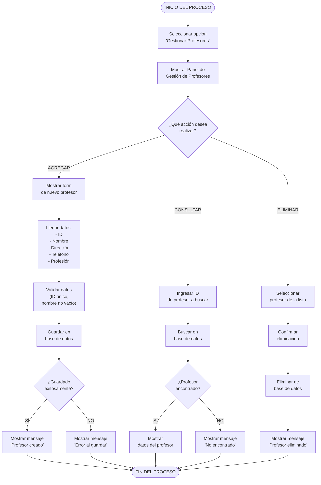

# Diagrama de Actividades - Gestionar Profesores (Mermaid)
## CU-04: Gestionar Profesores

---

## Descripción del Flujo

El usuario accede al panel de gestión de profesores y puede realizar tres acciones principales: **agregar**, **consultar** o **eliminar** un profesor. Cada acción tiene su propio subflujo con validaciones y manejo de errores. La eliminación puede disparar eliminación en cascada de sus asignaciones.

---

## Diagrama Mermaid

---

## Notas

- **Campos opcionales**: Dirección, teléfono y profesión son opcionales.
- **Integridad referencial**: Al eliminar un profesor, se eliminan también sus asignaciones en la tabla `Imparte`.
- **Carga académica**: Si el profesor tiene carga académica, se debe advertir y confirmar la eliminación en cascada.
- Las tres ramas convergen al final del proceso.

---

**Versión**: 1.0 (Mermaid)
**Fecha**: 10 de mayo de 2026
