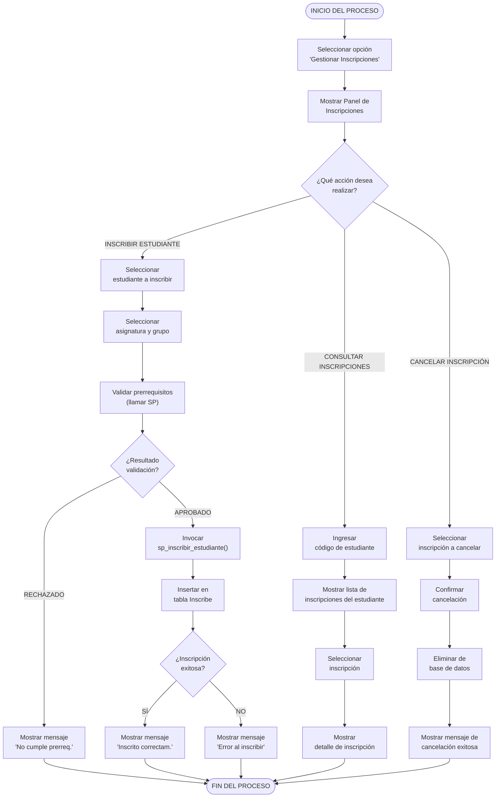

# Diagrama de Actividades - Gestionar Inscripciones (Mermaid)
## CU-06: Gestionar Inscripciones

---

## Descripción del Flujo

El usuario accede al panel de inscripciones y puede realizar tres acciones principales: **inscribir estudiante**, **consultar inscripciones** o **cancelar inscripción**. La inscripción incluye validación de prerrequisitos mediante un stored procedure (`sp_inscribir_estudiante`) que verifica que el estudiante haya aprobado todas las asignaturas requeridas.

---

## Diagrama Mermaid



---

## Notas

- **Stored Procedure**: `sp_inscribir_estudiante` verifica que el estudiante tenga aprobados (def >= 3.0) todos los prerrequisitos de la asignatura.
- **No duplicidad**: Un estudiante no puede inscribirse dos veces a la misma asignatura/grupo.
- **Carga académica**: Solo se puede inscribir a grupos que tengan profesor asignado.
- **Notas iniciales**: Al inscribirse, `n1`, `n2`, `n3` y `def` se inicializan en `0.00`.
- **Trigger**: `trg_calculo_notas` calcula la definitiva automáticamente al actualizar notas.

---

## Flujo del Stored Procedure

```
PROCEDIMIENTO: sp_inscribir_estudiante
─────────────────────────────────────────

1. Obtener lista de prerrequisitos de la asignatura a inscribir
   SELECT cod_a_r FROM Requiere WHERE cod_a = p_cod_a

2. Para cada prerrequisito:
   2.1 Verificar si el estudiante tiene inscripción aprobada en ese prerreq.
       SELECT EXISTS (
           SELECT 1 FROM Inscribe
           WHERE cod_e = p_cod_e AND cod_a = v_prereq AND def >= 3.0
       )

   2.2 Si no está aprobada (def < 3.0 o no existe):
       RAISE EXCEPTION 'Fallo de inscripción: Estudiante X no ha
                        aprobado el prerrequisito Y'

3. Si todos los prerrequisitos están aprobados:
   INSERT INTO Inscribe (cod_e, cod_a, id_p, grupo)
   VALUES (p_cod_e, p_cod_a, p_id_p, p_grupo)

4. Confirmar éxito:
   RAISE NOTICE 'Inscripción realizada con éxito'
```

---

**Versión**: 1.0 (Mermaid)
**Fecha**: 10 de mayo de 2026
