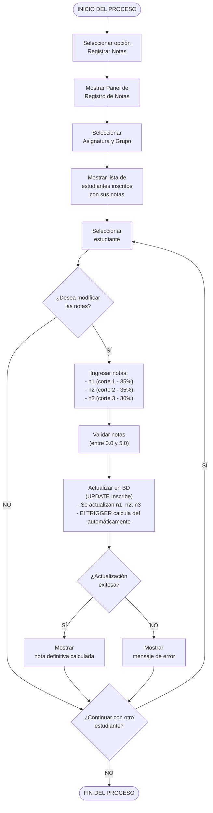

# Diagrama de Actividades - Registrar Notas (Mermaid)
## CU-07: Registrar Notas

---

## Descripción del Flujo

El usuario (profesor o administrador) accede al panel de registro de notas, selecciona una asignatura y grupo, y luego califica a cada estudiante inscrito de forma iterativa. Para cada estudiante, se ingresan las tres notas parciales (`n1`, `n2`, `n3`), se valida que estén en el rango permitido (0.0 - 5.0), se actualizan en la base de datos, y el trigger `trg_calculo_notas` calcula automáticamente la nota definitiva.

---

## Diagrama Mermaid



---

## Notas

- **Rango de notas**: `n1`, `n2`, `n3` deben estar entre **0.0 y 5.0**.
- **Cálculo automático**: La nota definitiva se calcula mediante trigger en PostgreSQL.
- **Fórmula de cálculo**: `definitiva = (n1 × 0.35) + (n2 × 0.35) + (n3 × 0.30)`
- **Precisión**: Las notas se almacenan con 2 decimales (`NUMERIC(3,2)`).
- **Permisos**: Solo el profesor asignado puede modificar las notas de su grupo.

---

## Flujo del Trigger

```
TRIGGER: trg_calculo_notas
──────────────────────────

SE DISPARA: ANTES de INSERT o UPDATE de n1, n2, n3 en la tabla Inscribe

FUNCIÓN: fn_calcular_definitiva()

  NEW.def := (NEW.n1 * 0.35) + (NEW.n2 * 0.35) + (NEW.n3 * 0.30);
  RETURN NEW;

EJEMPLO:
  n1 = 4.0, n2 = 3.5, n3 = 4.2

  def = (4.0 * 0.35) + (3.5 * 0.35) + (4.2 * 0.30)
  def = 1.40 + 1.225 + 1.26
  def = 3.885
```

---

## Permisos por Rol

| Rol | Acción Permitida |
|-----|------------------|
| Administrador | Puede modificar todas las notas |
| Profesor | Solo puede modificar notas de sus grupos (tabla Imparte) |
| Estudiante | Solo puede ver sus propias notas |

---

**Versión**: 1.0 (Mermaid)
**Fecha**: 10 de mayo de 2026
