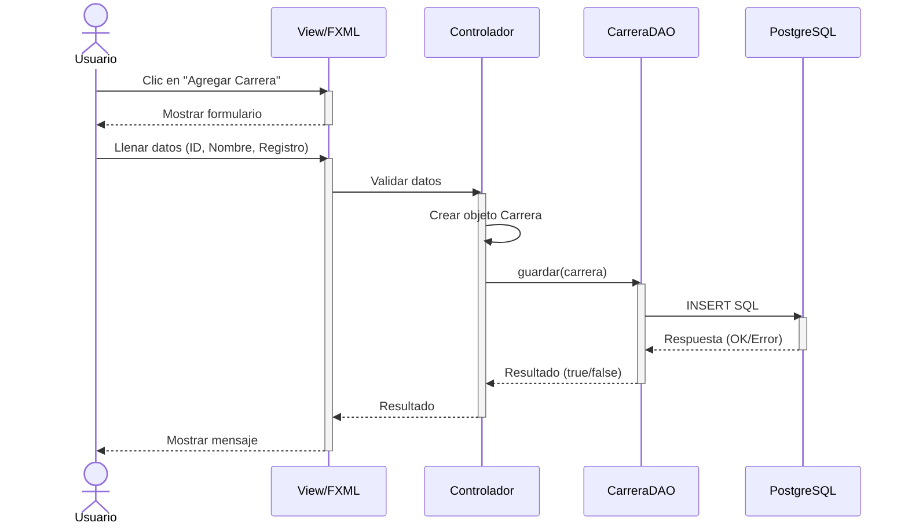
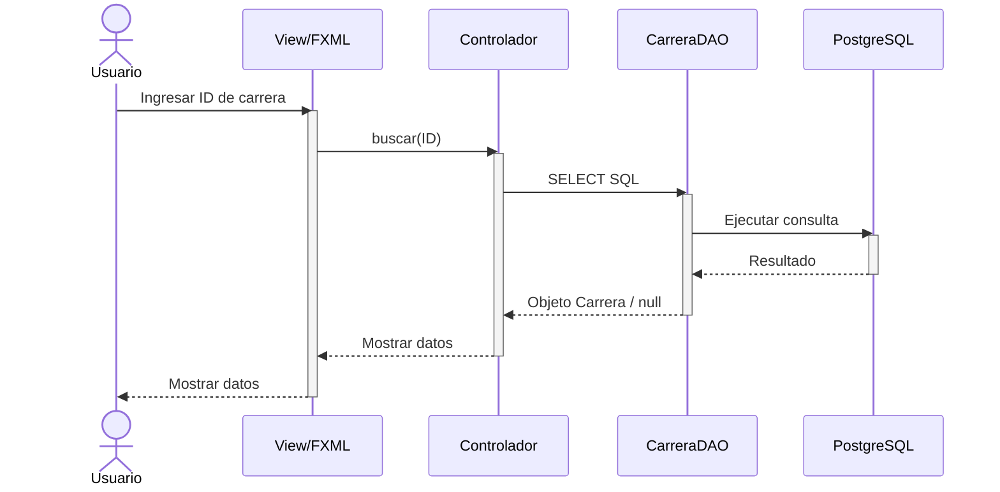

# Diagrama de Secuencia - Gestionar Carreras (Mermaid)
## CU-01: Gestionar Carreras

---

## 1. Diagrama de Secuencia - Agregar Carrera

Este diagrama muestra el flujo completo para registrar una nueva carrera en el sistema, desde la interacción del usuario hasta la persistencia en PostgreSQL.

---

## 2. Diagrama de Secuencia - Buscar Carrera

Este diagrama ilustra la consulta de una carrera existente por su identificador.

---

## 3. Descripción de Mensajes

| # | Mensaje | Descripción |
|---|---------|-------------|
| 1 | Clic en "Agregar Carrera" | El usuario solicita agregar una nueva carrera |
| 2 | Mostrar formulario | La vista presenta el formulario de ingreso |
| 3 | Llenar datos | El usuario ingresa ID, nombre y registro de calificación |
| 4 | Validar datos | El controlador verifica que los datos sean correctos |
| 5 | Crear objeto | Se instancia un objeto Carrera con los datos ingresados |
| 6 | guardar(carrera) | Se invoca el método del DAO para persistir |
| 7 | INSERT SQL | Se ejecuta la consulta en PostgreSQL |
| 8 | Respuesta | PostgreSQL retorna éxito o error |
| 9 | Resultado | El DAO retorna true/false al controlador |
| 10 | Mostrar mensaje | La vista informa al usuario el resultado |

---

## 4. Clases Participantes

| Clase | Rol |
|-------|-----|
| View/FXML | Interfaz gráfica (JavaFX) |
| ControladorCarrera | Coordina vista y modelo |
| CarreraDAO | Acceso a datos de PostgreSQL |
| Carrera | Modelo/Entidad del dominio |
| ConexionDB | Gestor de conexión (Singleton) |
| PostgreSQL | Motor de base de datos |

---

**Versión**: 1.0 (Mermaid)
**Fecha**: 9 de mayo de 2026
