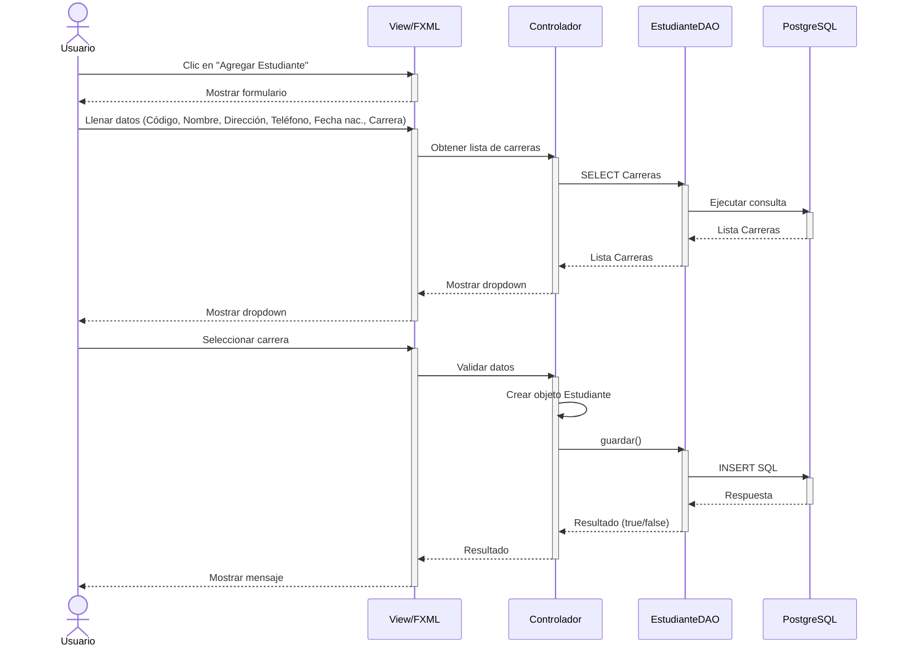
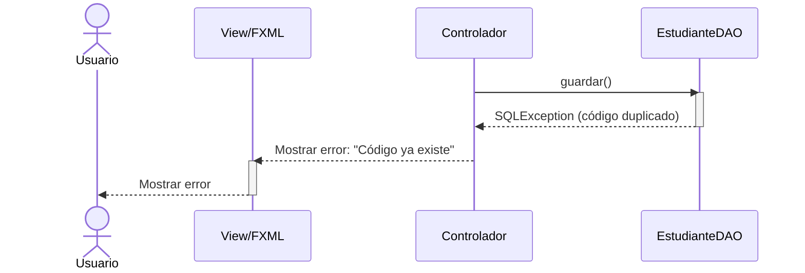

# Diagrama de Secuencia - Gestionar Estudiantes (Mermaid)
## CU-02: Gestionar Estudiantes

---

## 1. Diagrama de Secuencia - Agregar Estudiante

Este diagrama muestra el flujo para registrar un nuevo estudiante, incluyendo la carga dinámica de carreras desde la base de datos para el dropdown.

---

## 2. Diagrama de Secuencia - Excepción del Flujo (Código Duplicado)

Este diagrama representa el escenario alternativo cuando se intenta insertar un estudiante con un código que ya existe en la base de datos.

---

## 3. Descripción de Mensajes

| # | Mensaje | Descripción |
|---|---------|-------------|
| 1 | Clic en "Agregar Estudiante" | El usuario solicita agregar un nuevo estudiante |
| 2 | Mostrar formulario | La vista presenta el formulario de ingreso |
| 3 | Llenar datos | El usuario ingresa todos los campos del estudiante |
| 4 | Obtener lista de carreras | Se requiere la lista de carreras para el dropdown |
| 5 | SELECT Carreras | Consulta todas las carreras disponibles |
| 6 | Ejecutar consulta | PostgreSQL retorna la lista de carreras |
| 7 | Lista de carreras | Se retorna la lista al controlador |
| 8 | Mostrar dropdown | La vista muestra las carreras en un combo box |
| 9 | Seleccionar carrera | El usuario elige la carrera del estudiante |
| 10 | Validar datos | El controlador verifica campos obligatorios y FK |
| 11 | Crear objeto | Se instancia un objeto Estudiante |
| 12 | guardar() | Se invoca el método del DAO |
| 13 | INSERT SQL | Se ejecuta la inserción en PostgreSQL |
| 14 | Respuesta | PostgreSQL retorna éxito o error |
| 15 | Resultado | El DAO retorna true/false |
| 16 | Mostrar mensaje | La vista informa el resultado |

---

## 4. Reglas de Negocio Verificadas

| # | Regla | Momento de Verificación |
|---|-------|------------------------|
| RB1 | Código único | Antes del INSERT, verifica que no exista |
| RB2 | Nombre obligatorio | En validación de datos |
| RB3 | Carrera existente | FK validada contra tabla Carreras |
| RB4 | Fecha de nacimiento válida | No futura, formato correcto |

---

**Versión**: 1.0 (Mermaid)
**Fecha**: 9 de mayo de 2026
