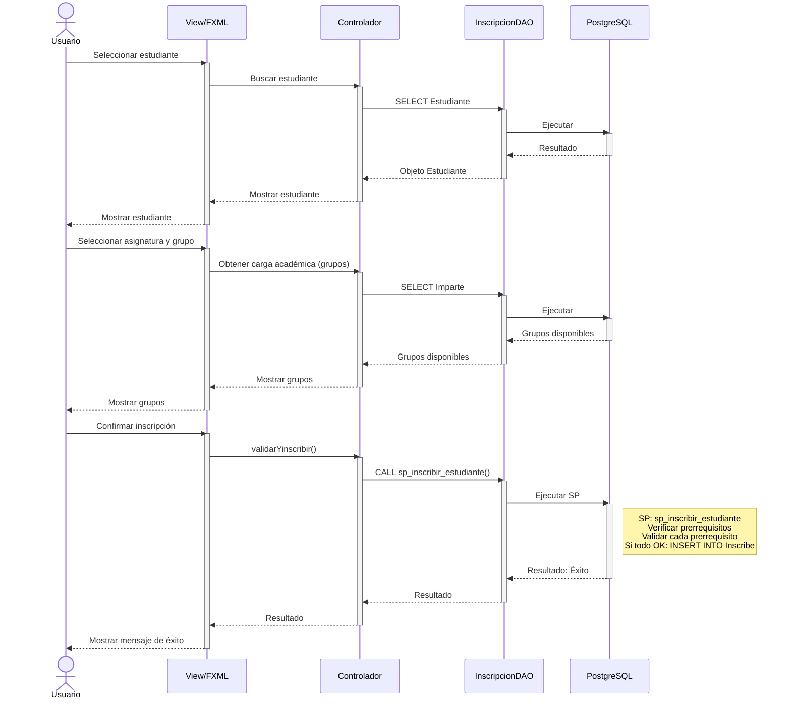
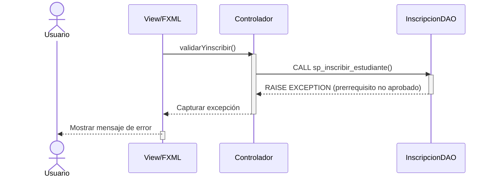

# Diagrama de Secuencia - Gestionar Inscripciones (Mermaid)
## CU-06: Gestionar Inscripciones

---

## 1. Diagrama de Secuencia - Inscribir Estudiante (Con SP)

Este diagrama representa el flujo principal de inscripción, donde un stored procedure valida prerrequisitos antes de insertar el registro.



---

## 2. Diagrama de Secuencia - Prerrequisito No Aprobado

Este diagrama ilustra el escenario de error cuando el stored procedure detecta que el estudiante no ha aprobado algún prerrequisito.



---

## 3. Descripción de Mensajes Clave

| # | Mensaje | Descripción |
|---|---------|-------------|
| 1-7 | Seleccionar estudiante | El usuario busca y selecciona un estudiante |
| 8-13 | Seleccionar asignatura/grupo | Se muestran los grupos disponibles con profesor asignado |
| 14-21 | Proceso de inscripción | Se invoca el Stored Procedure para validar prerrequisitos e insertar |

---

## 4. Flujo del Stored Procedure (Detalle)

```
SP: sp_inscribir_estudiante

PARÁMETROS DE ENTRADA:
- p_cod_e: VARCHAR  → Código del estudiante
- p_cod_a: VARCHAR  → Código de la asignatura
- p_id_p: VARCHAR   → ID del profesor
- p_grupo: INT      → Número de grupo

LÓGICA:

1. FOR v_prereq IN (SELECT cod_a_r FROM Requiere WHERE cod_a = p_cod_a)
   Por cada prerrequisito:
   
   2. SELECT EXISTS (
        SELECT 1 FROM Inscribe
        WHERE cod_e = p_cod_e
          AND cod_a = v_prereq
          AND def >= 3.0
      ) INTO v_aprobada;
   
   3. IF NOT v_aprobada THEN
        RAISE EXCEPTION 'El estudiante no ha aprobado el prerrequisito %', v_prereq;
      END IF;

4. Si todos los prerrequisitos están aprobados:
   INSERT INTO Inscribe (cod_e, cod_a, id_p, grupo)
   VALUES (p_cod_e, p_cod_a, p_id_p, p_grupo);

5. RAISE NOTICE 'Inscripción realizada con éxito';
```

---

## 5. Casos de Prueba

| ID | Escenario | Entrada | Resultado Esperado |
|----|-----------|---------|-------------------|
| CP01 | Inscripción exitosa | Estudiante E100, Asignatura PROG2, Prerrequisito PROG1 aprobado | Inscripción creada |
| CP02 | Prerrequisito no aprobado | Estudiante E101, Asignatura PROG2, Prerrequisito PROG1 no aprobado | Error: "Fallo de inscripción" |
| CP03 | Grupo sin profesor | Asignatura sin carga académica | Error: "No hay grupo disponible" |
| CP04 | Inscripción duplicada | Estudiante ya inscrito en mismo grupo | Error: "Ya está inscrito" |

---

**Versión**: 1.0 (Mermaid)
**Fecha**: 9 de mayo de 2026
