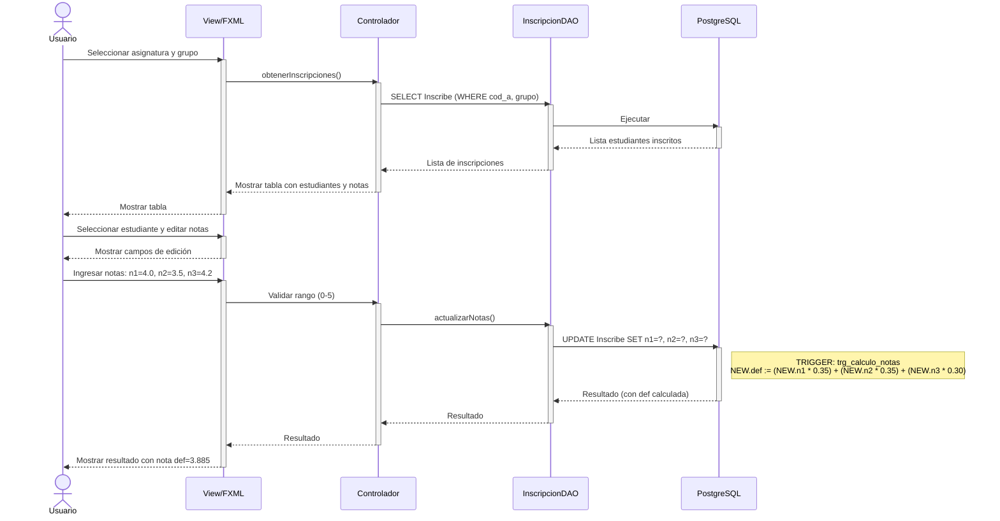
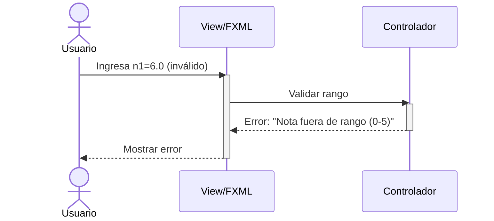

# Diagrama de Secuencia - Registrar Notas (Mermaid)
## CU-07: Registrar Notas

---

## 1. Diagrama de Secuencia - Actualizar Notas

Este diagrama describe el flujo de actualización de notas para un grupo determinado, destacando la ejecución del trigger que calcula automáticamente la nota definitiva.



---

## 2. Diagrama de Secuencia - Validación de Rango

Este diagrama muestra el flujo alternativo cuando el usuario intenta ingresar una nota fuera del rango permitido (0-5).



---

## 3. Descripción de Mensajes Clave

| # | Mensaje | Descripción |
|---|---------|-------------|
| 1-2 | Seleccionar asignatura/grupo | El usuario elige qué materia y grupo va a calificar |
| 3-6 | Cargar inscripciones | Se consultan los estudiantes inscritos en ese grupo |
| 7 | Mostrar tabla | La vista presenta la lista con notas actuales |
| 8-9 | Seleccionar estudiante | El usuario hace clic en un estudiante para editar |
| 10-11 | Ingresar notas | El usuario ingresa n1, n2, n3 |
| 12-14 | Actualizar en BD | Se ejecuta UPDATE; el trigger calcula automáticamente la definitiva |

---

## 4. Flujo del Trigger (Detalle)

```
TRIGGER: trg_calculo_notas

SE DISPARA: ANTES de INSERT o UPDATE en la tabla Inscribe

EVENTO: UPDATE OF n1, n2, n3 ON Inscribe

FUNCIÓN: fn_calcular_definitiva()

BEGIN
    -- Cálculo de nota definitiva
    NEW.def := (NEW.n1 * 0.35) + (NEW.n2 * 0.35) + (NEW.n3 * 0.30);

    -- Retornar el nuevo registro con la definitiva calculada
    RETURN NEW;
END;

EJEMPLO DE EJECUCIÓN:
  Entrada:  n1 = 4.0, n2 = 3.5, n3 = 4.2

  Cálculo:
    def = (4.0 * 0.35) + (3.5 * 0.35) + (4.2 * 0.30)
    def = 1.40 + 1.225 + 1.26
    def = 3.885

  Resultado almacenado: def = 3.89 (redondeado a 2 decimales)
```

---

## 5. Escenarios de Uso

### 5.1 Actualización Exitosa

| Paso | Descripción |
|------|-------------|
| 1 | El profesor selecciona "Programación I - Grupo 1" |
| 2 | El sistema muestra 15 estudiantes con notas actuales |
| 3 | El profesor hace clic en "Carlos Martínez" |
| 4 | El sistema muestra campos de edición: n1, n2, n3 |
| 5 | El profesor ingresa: n1=4.0, n2=3.5, n3=4.2 |
| 6 | El sistema calcula def=3.885 y lo muestra |
| 7 | El sistema guarda en PostgreSQL |

---

## 6. Permisos por Rol

| Rol | Tabla Inscribe | Acción |
|-----|----------------|--------|
| Administrador | ALL | Puede modificar cualquier nota |
| Profesor | UPDATE (n1, n2, n3) | Solo notas de sus grupos |
| Estudiante | SELECT | Solo puede ver sus propias notas |

---

**Versión**: 1.0 (Mermaid)
**Fecha**: 9 de mayo de 2026
