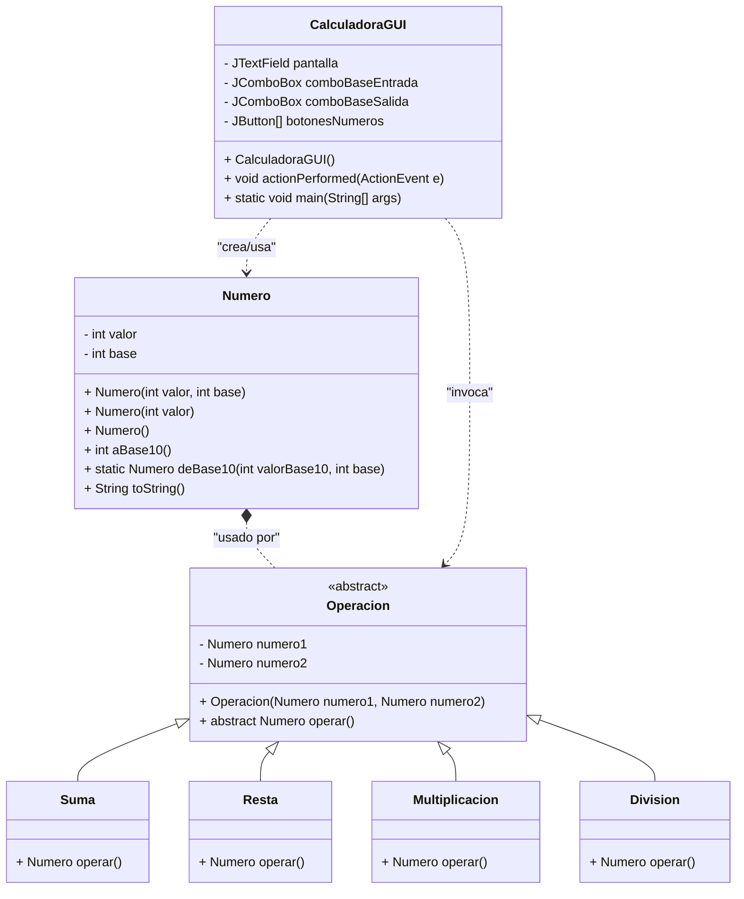

# Calculadora en Java (Taller)

## Objetivo
Desarrollar una calculadora modular en Java aplicando los principios SOLID. El sistema debe permitir operar números en cualquier base menor o igual a 10, con validaciones adecuadas.

## Estructura de Clases

- **Numero**: Representa un número en una base específica.
  - Atributos: `valor`, `base`
  - Métodos: `aBase10()`, `deBase10()` (conversiones entre bases, validando restricciones)

- **Operacion (abstracta)**: Clase base para operaciones aritméticas.
  - Atributos: dos instancias de `Numero`
  - Método abstracto: `operar()`

- **Suma, Resta, Multiplicacion, Division**: Heredan de `Operacion` e implementan `operar()`.

## Organización de archivos
- Cada clase en su propio archivo dentro de la carpeta `Calculadora`.
- Incluir pruebas o ejemplos de uso.

